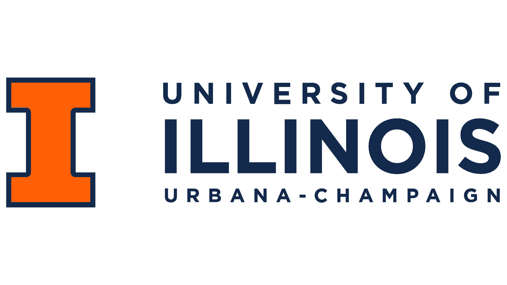
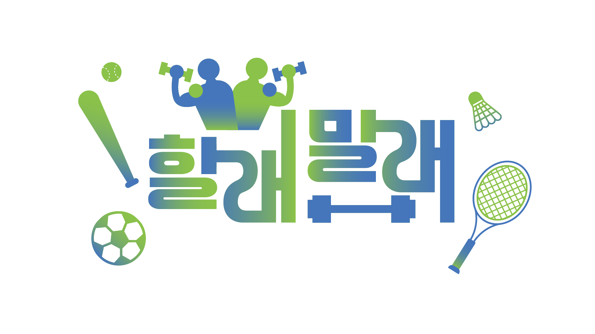

# 강대광 | AI Developer

> 데이터 구조부터 서비스 흐름까지 설계하고, AI를 실제 제품으로 연결하는 Developer

  

AI 모델 구현에 그치지 않고, 데이터 수집·전처리·학습·평가·서비스 연동까지  
전 과정을 설계하며 운영 가능한 시스템으로 구현합니다.

---

## 🧠 What I Do

- 문제 정의부터 구조 설계, 구현까지 흐름 있게 개발합니다
- 데이터 흐름을 기준으로 디버깅하고 시스템을 개선합니다
- AI 모델을 서비스 기능으로 연결하는 구조를 설계합니다
- 실험에서 끝나지 않고 배포와 운영까지 고려합니다

---

## 👋 About Me

UIUC에서 심리학을 전공하며 사람의 행동과 의사결정을 분석하는 관점을 배웠습니다.  
이 경험은 데이터를 구조적으로 이해하는 기반이 되었습니다.

이후 개발을 접하며 문제를 직접 구현하는 과정에 매력을 느꼈고,  
AI 개발로 관심을 확장했습니다.

현재는 KOREA IT ACADEMY KDT AI 과정을 통해  
모델 설계와 LLM 기반 시스템 구현 역량을 심화하고 있습니다.

---

## 🚀 Selected Projects

### 🔹 할래말래 | 공공체육센터 예약 & 운동 메이트 플랫폼

  

공공데이터를 재구성해 예약 기능과 커뮤니티 기능을 통합한 웹 서비스

- 팀장
- 데이터 구조 재설계 및 DB 모델링
- Django REST API 설계 및 구현
- Ajax 기반 비동기 처리
- AWS EC2 배포

👉 Repository: https://github.com/MUNJI-KANG/Best_Choice_Project

### 🔹 JINRO IS | AI 기반 진로 상담 플랫폼

  

학생의 집중도, 흥미도, 설문 응답, 상담 대화를 분석해  
상담사가 빠르게 판단할 수 있는 진로 리포트를 생성하는 AI 보조형 상담 서비스

- 팀장
- 집중도 분석 모델 개발 및 고도화
- React 기반 온보딩 플로우 설계 및 사용자 경험 개선
- FastAPI 기반 AI 서버 연동 및 비동기 분석 처리
- 시선 데이터, STT, LLM 요약을 결합한 리포트 자동화

👉 Repository: https://github.com/MUNJI-KANG/Jinro_Proj_Portfolio

---

## 🛠 Tech Stack

### AI / ML
- Scikit-learn
- TensorFlow / Keras

### LLM / NLP
- RAG
- HuggingFace
- LangChain / LangGraph

### Backend
- Django
- FastAPI
- REST API

### Frontend
- React
- HTML

### Database
- MySQL
- MongoDB
- Oracle / Tibero

### Infra
- AWS (EC2)

---

## 🎯 Direction

데이터를 이해하고  
구조를 설계하며  
AI를 실제 제품에 적용할 수 있는 개발자로 성장하고 있습니다.

---

## 📫 Contact

- Email: eorhkd7078@naver.com
- GitHub: https://github.com/MUNJI-KANG
